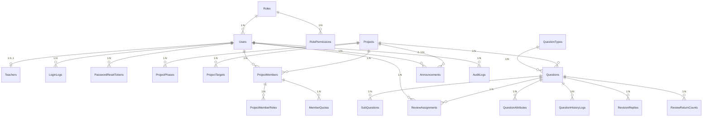

# CWT 命題工作平臺 — 統一資料庫規劃

> **文件版本**：v1.0  
> **資料來源**：10 份 PRD 文件交叉比對整合  
> **目標資料庫**：SQL Server（未來 Blazor .NET 10 + EF Core）

---

## 全域設計原則

| 項目       | 統一標準                                                                        |
| ---------- | ------------------------------------------------------------------------------- |
| **主鍵**   | `int IDENTITY(1,1)`（所有表統一，棄用 UNIQUEIDENTIFIER）                        |
| **命名**   | 表名 `PascalCase` 複數、欄位 `PascalCase`、索引 `IX_表_欄位`、FK `FK_子表_父表` |
| **時間戳** | 每表必備 `CreatedAt` / `UpdatedAt`，型別 `datetime2`，預設 `GETDATE()`          |
| **軟刪除** | 需要時使用 `IsDeleted bit DEFAULT 0` + `DeletedAt datetime2 NULL`               |
| **字串**   | 一律 `nvarchar`（支援中文），長度依業務需求設定                                 |
| **布林**   | `bit`，預設值明確標註                                                           |
| **正規化** | 遵守 3NF，僅在查詢效能需求明確時允許適度反正規化                                |

---

## 資料表總覽（28 表 + 2 View）

### 核心領域分群

| 群組           | 資料表                                                                                           |
| -------------- | ------------------------------------------------------------------------------------------------ |
| **帳號與權限** | Users、Roles、RolePermissions、PasswordResetTokens、LoginLogs                                    |
| **教師人才庫** | Teachers                                                                                         |
| **專案管理**   | Projects、ProjectPhases、ProjectTargets、ProjectMembers、ProjectMemberRoles、MemberQuotas        |
| **題目與命題** | Questions、SubQuestions、QuestionAttributes、QuestionTypes、QuestionHistoryLogs、RevisionReplies |
| **審題制度**   | ReviewAssignments、ReviewReturnCounts、SimilarityChecks、CannedMessages                          |
| **公告與手冊** | Announcements、UserGuideFiles                                                                    |
| **系統**       | Modules、AuditLogs                                                                               |
| **檢視表**     | DashboardSummaryView、OverdueTasksView                                                           |

---

## 1. 帳號與權限群組

### 1.1 Roles

```sql
CREATE TABLE Roles (
    Id              int IDENTITY(1,1) PRIMARY KEY,
    Code            nvarchar(50)  NOT NULL UNIQUE,   -- 'ADMIN','TEACHER','REVIEWER','CHIEF' 等
    Name            nvarchar(50)  NOT NULL UNIQUE,   -- '系統管理員','命題教師' 等
    Category        nvarchar(20)  NOT NULL,          -- 'internal' / 'external'
    Description     nvarchar(500) NULL,
    IsDefault       bit           NOT NULL DEFAULT 0,-- 預設角色不可修改權限
    CreatedAt       datetime2     NOT NULL DEFAULT GETDATE(),
    UpdatedAt       datetime2     NOT NULL DEFAULT GETDATE()
);
```

**Seed Data**：命題教師(external,✅)、審題委員(external,✅)、總召(internal,✅)、系統管理員(internal,❌)、計畫主持人(internal,❌)、教務管理者(internal,❌)

### 1.2 Users

```sql
CREATE TABLE Users (
    Id              int IDENTITY(1,1) PRIMARY KEY,
    Username        nvarchar(100) NOT NULL UNIQUE,   -- 內部人員=自訂帳號, 外部=Email
    DisplayName     nvarchar(50)  NOT NULL,
    Email           nvarchar(200) NULL,
    PasswordHash    nvarchar(500) NOT NULL,
    RoleId          int           NOT NULL REFERENCES Roles(Id),
    Status          nvarchar(20)  NOT NULL DEFAULT 'active', -- active / inactive
    CompanyTitle    nvarchar(100) NULL,               -- 內部人員公司職稱
    Note            nvarchar(500) NULL,
    IsFirstLogin    bit           NOT NULL DEFAULT 1,
    RememberToken   nvarchar(500) NULL,
    LastLoginAt     datetime2     NULL,
    CreatedAt       datetime2     NOT NULL DEFAULT GETDATE(),
    UpdatedAt       datetime2     NOT NULL DEFAULT GETDATE()
);
CREATE INDEX IX_Users_RoleId ON Users(RoleId);
CREATE INDEX IX_Users_Status ON Users(Status);
CREATE INDEX IX_Users_Email  ON Users(Email);
```

### 1.3 RolePermissions

```sql
CREATE TABLE RolePermissions (
    Id                int IDENTITY(1,1) PRIMARY KEY,
    RoleId            int          NOT NULL REFERENCES Roles(Id),
    ModuleKey         nvarchar(50) NOT NULL,          -- 'dashboard','compose','review' 等
    IsEnabled         bit          NOT NULL DEFAULT 0,
    AnnouncementPerm  nvarchar(10) DEFAULT 'view',   -- 僅 ModuleKey='announcements' 有效
    CreatedAt         datetime2    NOT NULL DEFAULT GETDATE(),
    UpdatedAt         datetime2    NOT NULL DEFAULT GETDATE(),
    CONSTRAINT UQ_RolePerm_Role_Module UNIQUE (RoleId, ModuleKey)
);
```

### 1.4 PasswordResetTokens

```sql
CREATE TABLE PasswordResetTokens (
    Id          int IDENTITY(1,1) PRIMARY KEY,
    UserId      int           NOT NULL REFERENCES Users(Id),
    Token       nvarchar(500) NOT NULL UNIQUE,
    ExpiresAt   datetime2     NOT NULL,              -- 10 分鐘有效
    IsUsed      bit           NOT NULL DEFAULT 0,
    CreatedAt   datetime2     NOT NULL DEFAULT GETDATE()
);
CREATE INDEX IX_PRT_Token ON PasswordResetTokens(Token);
```

### 1.5 LoginLogs

```sql
CREATE TABLE LoginLogs (
    Id          int IDENTITY(1,1) PRIMARY KEY,
    UserId      int           NULL REFERENCES Users(Id), -- 登入失敗時可能為 NULL
    Username    nvarchar(100) NOT NULL,
    IsSuccess   bit           NOT NULL,
    IpAddress   nvarchar(50)  NULL,
    UserAgent   nvarchar(500) NULL,
    FailReason  nvarchar(200) NULL,
    CreatedAt   datetime2     NOT NULL DEFAULT GETDATE()
);
CREATE INDEX IX_LoginLogs_UserId ON LoginLogs(UserId);
```

---

## 2. 教師人才庫

### 2.1 Teachers

```sql
CREATE TABLE Teachers (
    Id              int IDENTITY(1,1) PRIMARY KEY,
    UserId          int          NOT NULL UNIQUE REFERENCES Users(Id), -- 1:1 關聯
    TeacherCode     nvarchar(10) NOT NULL UNIQUE,    -- 'T1001' 流水號
    Gender          nvarchar(5)  NULL,               -- '男' / '女'
    Phone           nvarchar(20) NULL,
    IdNumber        nvarchar(200) NULL,              -- 身分證（加密儲存）
    School          nvarchar(100) NOT NULL,
    Department      nvarchar(50) NULL,
    Title           nvarchar(20) NULL,               -- 教授/副教授/講師 等
    Expertise       nvarchar(200) NULL,
    TeachingYears   int          NULL,
    Education       nvarchar(10) NULL,               -- 博士/碩士/學士
    Note            nvarchar(500) NULL,
    CreatedAt       datetime2    NOT NULL DEFAULT GETDATE(),
    UpdatedAt       datetime2    NOT NULL DEFAULT GETDATE()
);
```

> **帳號合併機制**：新增教師時若 Email 已存在於 Users，則直接指向該 UserId，不建立新帳號。

---

## 3. 專案管理群組

### 3.1 Projects

```sql
CREATE TABLE Projects (
    Id              int IDENTITY(1,1) PRIMARY KEY,
    ProjectCode     nvarchar(20)  NOT NULL UNIQUE,   -- 'P2026-01'
    Name            nvarchar(100) NOT NULL,
    Year            int           NOT NULL,
    Semester        nvarchar(20)  NULL,              -- '春季' / '秋季'
    School          nvarchar(100) NULL,              -- 合作學校（選填）
    Status          nvarchar(20)  NOT NULL DEFAULT 'preparing', -- preparing/active/closed
    StartDate       date          NOT NULL,
    EndDate         date          NOT NULL,
    ClosedAt        datetime2     NULL,
    CreatedBy       int           NULL REFERENCES Users(Id),
    Description     nvarchar(500) NULL,
    CreatedAt       datetime2     NOT NULL DEFAULT GETDATE(),
    UpdatedAt       datetime2     NOT NULL DEFAULT GETDATE()
);
CREATE INDEX IX_Projects_Status ON Projects(Status);
```

### 3.2 ProjectPhases

```sql
CREATE TABLE ProjectPhases (
    Id          int IDENTITY(1,1) PRIMARY KEY,
    ProjectId   int          NOT NULL REFERENCES Projects(Id),
    PhaseCode   nvarchar(30) NOT NULL, -- proposing/peer_review/peer_edit/expert_review/expert_edit/final_review/final_edit
    PhaseName   nvarchar(50) NOT NULL,
    StartDate   date         NOT NULL,
    EndDate     date         NOT NULL,
    SortOrder   int          NOT NULL,
    CreatedAt   datetime2    NOT NULL DEFAULT GETDATE(),
    UpdatedAt   datetime2    NOT NULL DEFAULT GETDATE(),
    CONSTRAINT UQ_PP_Project_Phase UNIQUE (ProjectId, PhaseCode)
);
```

### 3.3 ProjectTargets

```sql
CREATE TABLE ProjectTargets (
    Id              int IDENTITY(1,1) PRIMARY KEY,
    ProjectId       int          NOT NULL REFERENCES Projects(Id),
    QuestionTypeId  int          NOT NULL REFERENCES QuestionTypes(Id),
    Level           nvarchar(20) NOT NULL,           -- '初級','中級' 等
    TargetCount     int          NOT NULL DEFAULT 0,
    CreatedAt       datetime2    NOT NULL DEFAULT GETDATE(),
    UpdatedAt       datetime2    NOT NULL DEFAULT GETDATE(),
    CONSTRAINT UQ_PT UNIQUE (ProjectId, QuestionTypeId, Level)
);
```

### 3.4 ProjectMembers

```sql
CREATE TABLE ProjectMembers (
    Id          int IDENTITY(1,1) PRIMARY KEY,
    ProjectId   int NOT NULL REFERENCES Projects(Id),
    UserId      int NOT NULL REFERENCES Users(Id),
    JoinedAt    datetime2 NOT NULL DEFAULT GETDATE(),
    CreatedAt   datetime2 NOT NULL DEFAULT GETDATE(),
    UpdatedAt   datetime2 NOT NULL DEFAULT GETDATE(),
    CONSTRAINT UQ_PM UNIQUE (ProjectId, UserId)
);
```

### 3.5 ProjectMemberRoles（支援一人多角色）

```sql
CREATE TABLE ProjectMemberRoles (
    Id              int IDENTITY(1,1) PRIMARY KEY,
    ProjectMemberId int          NOT NULL REFERENCES ProjectMembers(Id),
    RoleCode        nvarchar(30) NOT NULL, -- 'proposer','peer_reviewer','expert_reviewer','chief' 等
    CreatedAt       datetime2    NOT NULL DEFAULT GETDATE(),
    CONSTRAINT UQ_PMR UNIQUE (ProjectMemberId, RoleCode)
);
```

### 3.6 MemberQuotas

```sql
CREATE TABLE MemberQuotas (
    Id              int IDENTITY(1,1) PRIMARY KEY,
    ProjectMemberId int NOT NULL REFERENCES ProjectMembers(Id),
    QuestionTypeId  int NOT NULL REFERENCES QuestionTypes(Id),
    Level           nvarchar(20) NOT NULL,
    QuotaCount      int NOT NULL DEFAULT 0,
    CreatedAt       datetime2 NOT NULL DEFAULT GETDATE(),
    UpdatedAt       datetime2 NOT NULL DEFAULT GETDATE(),
    CONSTRAINT UQ_MQ UNIQUE (ProjectMemberId, QuestionTypeId, Level)
);
```

---

## 4. 題目與命題群組

### 4.1 QuestionTypes（參照表）

```sql
CREATE TABLE QuestionTypes (
    Id          int IDENTITY(1,1) PRIMARY KEY,
    Code        nvarchar(30) NOT NULL UNIQUE, -- general/select/essay/short_group/reading_group/listening/listening_group
    Name        nvarchar(50) NOT NULL,
    Icon        nvarchar(50) NULL,            -- FontAwesome class
    SortOrder   int          NOT NULL DEFAULT 0,
    IsActive    bit          NOT NULL DEFAULT 1,
    CreatedAt   datetime2    NOT NULL DEFAULT GETDATE()
);
```

### 4.2 Questions

```sql
CREATE TABLE Questions (
    Id              int IDENTITY(1,1) PRIMARY KEY,
    ProjectId       int           NOT NULL REFERENCES Projects(Id),
    QuestionTypeId  int           NOT NULL REFERENCES QuestionTypes(Id),
    QuestionCode    nvarchar(30)  NOT NULL UNIQUE,    -- 'Q-2602-001'
    CreatorId       int           NOT NULL REFERENCES Users(Id),
    Status          nvarchar(30)  NOT NULL DEFAULT 'draft',
    -- 14 種狀態: draft/completed/submitted/peer_locked/peer_editing/
    -- expert_locked/expert_editing/final_locked/final_editing/
    -- adopted/rejected/draft_deleted/final_chief_editing/pending_queue
    Level           nvarchar(20)  NULL,               -- 初級/中級/中高級/高級/優級/難度一~五
    Difficulty      nvarchar(10)  NULL,               -- easy/medium/hard
    Stem            nvarchar(MAX) NULL,               -- 題幹 HTML
    Analysis        nvarchar(MAX) NULL,               -- 試題解析 HTML
    CorrectAnswer   nvarchar(10)  NULL,               -- A/B/C/D
    OptionA         nvarchar(MAX) NULL,
    OptionB         nvarchar(MAX) NULL,
    OptionC         nvarchar(MAX) NULL,
    OptionD         nvarchar(MAX) NULL,
    ArticleTitle    nvarchar(200) NULL,               -- 題組/長文標題
    ArticleContent  nvarchar(MAX) NULL,               -- 文章/語音內容 HTML
    AudioUrl        nvarchar(500) NULL,               -- 聽力音檔 URL
    GradingNote     nvarchar(MAX) NULL,               -- 長文批閱說明
    IsDeleted       bit           NOT NULL DEFAULT 0,
    DeletedAt       datetime2     NULL,
    CreatedAt       datetime2     NOT NULL DEFAULT GETDATE(),
    UpdatedAt       datetime2     NOT NULL DEFAULT GETDATE()
);
CREATE INDEX IX_Questions_ProjectId ON Questions(ProjectId);
CREATE INDEX IX_Questions_Status    ON Questions(Status);
CREATE INDEX IX_Questions_CreatorId ON Questions(CreatorId);
CREATE INDEX IX_Questions_TypeId    ON Questions(QuestionTypeId);
```

### 4.3 QuestionAttributes

```sql
CREATE TABLE QuestionAttributes (
    Id              int IDENTITY(1,1) PRIMARY KEY,
    QuestionId      int          NOT NULL REFERENCES Questions(Id),
    AttributeKey    nvarchar(50) NOT NULL, -- major_category/minor_category/genre/voice_type/material_type/core_ability/indicator
    AttributeValue  nvarchar(200) NOT NULL,
    CreatedAt       datetime2    NOT NULL DEFAULT GETDATE(),
    CONSTRAINT UQ_QA UNIQUE (QuestionId, AttributeKey)
);
```

### 4.4 SubQuestions

```sql
CREATE TABLE SubQuestions (
    Id              int IDENTITY(1,1) PRIMARY KEY,
    ParentQuestionId int          NOT NULL REFERENCES Questions(Id),
    SortOrder       int          NOT NULL DEFAULT 1,
    Stem            nvarchar(MAX) NULL,
    CorrectAnswer   nvarchar(10) NULL,
    OptionA         nvarchar(MAX) NULL,
    OptionB         nvarchar(MAX) NULL,
    OptionC         nvarchar(MAX) NULL,
    OptionD         nvarchar(MAX) NULL,
    Analysis        nvarchar(MAX) NULL,
    CoreAbility     nvarchar(100) NULL,   -- 聽力題組子題固定
    Indicator       nvarchar(100) NULL,
    FixedDifficulty nvarchar(20) NULL,    -- 聽力題組子題固定難度
    CreatedAt       datetime2    NOT NULL DEFAULT GETDATE(),
    UpdatedAt       datetime2    NOT NULL DEFAULT GETDATE()
);
CREATE INDEX IX_SubQ_ParentId ON SubQuestions(ParentQuestionId);
```

### 4.5 QuestionHistoryLogs

```sql
CREATE TABLE QuestionHistoryLogs (
    Id          int IDENTITY(1,1) PRIMARY KEY,
    QuestionId  int           NOT NULL REFERENCES Questions(Id),
    UserId      int           NOT NULL REFERENCES Users(Id),
    Action      nvarchar(50)  NOT NULL, -- created/submitted/peer_comment/expert_adopt/final_reject 等
    Comment     nvarchar(MAX) NULL,     -- 審查意見 HTML
    OldStatus   nvarchar(30)  NULL,
    NewStatus   nvarchar(30)  NULL,
    CreatedAt   datetime2     NOT NULL DEFAULT GETDATE()
);
CREATE INDEX IX_QHL_QuestionId ON QuestionHistoryLogs(QuestionId);
```

### 4.6 RevisionReplies

```sql
CREATE TABLE RevisionReplies (
    Id          int IDENTITY(1,1) PRIMARY KEY,
    QuestionId  int           NOT NULL REFERENCES Questions(Id),
    UserId      int           NOT NULL REFERENCES Users(Id),
    Stage       nvarchar(20)  NOT NULL, -- 'peer'/'expert'/'final'
    Content     nvarchar(MAX) NOT NULL, -- 修題回覆 HTML
    CreatedAt   datetime2     NOT NULL DEFAULT GETDATE()
);
CREATE INDEX IX_RR_QuestionId ON RevisionReplies(QuestionId);
```

---

## 5. 審題制度群組

### 5.1 ReviewAssignments

```sql
CREATE TABLE ReviewAssignments (
    Id              int IDENTITY(1,1) PRIMARY KEY,
    QuestionId      int          NOT NULL REFERENCES Questions(Id),
    ProjectId       int          NOT NULL REFERENCES Projects(Id),
    ReviewerId      int          NOT NULL REFERENCES Users(Id),
    ReviewStage     nvarchar(10) NOT NULL,            -- 'peer'/'expert'/'final'
    ReviewStatus    nvarchar(10) NOT NULL DEFAULT 'pending', -- pending/decided
    Decision        nvarchar(10) NULL,                -- comment/adopt/revise/reject
    Comment         nvarchar(MAX) NULL,
    DecidedAt       datetime2    NULL,
    CreatedAt       datetime2    NOT NULL DEFAULT GETDATE(),
    CONSTRAINT UQ_RA UNIQUE (QuestionId, ReviewerId, ReviewStage)
);
CREATE INDEX IX_RA_ReviewerId ON ReviewAssignments(ReviewerId);
CREATE INDEX IX_RA_ProjectId  ON ReviewAssignments(ProjectId);
```

### 5.2 ReviewReturnCounts

```sql
CREATE TABLE ReviewReturnCounts (
    Id                  int IDENTITY(1,1) PRIMARY KEY,
    QuestionId          int NOT NULL REFERENCES Questions(Id),
    FinalReviewerId     int NOT NULL REFERENCES Users(Id),
    ReturnCount         int NOT NULL DEFAULT 0,       -- 最大 2，第 3 次不退回
    CanEditByReviewer   bit NOT NULL DEFAULT 0,       -- ReturnCount >= 2 時為 1
    CONSTRAINT UQ_RRC UNIQUE (QuestionId, FinalReviewerId)
);
```

### 5.3 SimilarityChecks

```sql
CREATE TABLE SimilarityChecks (
    Id                  int IDENTITY(1,1) PRIMARY KEY,
    SourceQuestionId    int          NOT NULL REFERENCES Questions(Id),
    ComparedQuestionId  int          NOT NULL REFERENCES Questions(Id),
    SimilarityScore     decimal(5,2) NOT NULL,
    Determination       nvarchar(20) NOT NULL, -- '無疑慮'/'低度相似'/'高度相似'
    CheckedBy           int          NULL REFERENCES Users(Id),
    CheckedAt           datetime2    NOT NULL DEFAULT GETDATE()
);
```

### 5.4 CannedMessages

```sql
CREATE TABLE CannedMessages (
    Id          int IDENTITY(1,1) PRIMARY KEY,
    Content     nvarchar(500) NOT NULL,
    SortOrder   int           NOT NULL DEFAULT 0,
    IsActive    bit           NOT NULL DEFAULT 1,
    CreatedAt   datetime2     NOT NULL DEFAULT GETDATE()
);
```

---

## 6. 公告與手冊群組

### 6.1 Announcements

```sql
CREATE TABLE Announcements (
    Id              int IDENTITY(1,1) PRIMARY KEY,
    Category        nvarchar(20)  NOT NULL,          -- system/compose/review/other
    Status          nvarchar(20)  NOT NULL DEFAULT 'draft', -- draft/published/archived
    ProjectId       int           NULL REFERENCES Projects(Id), -- NULL=全站廣播
    PublishDate     date          NOT NULL,
    UnpublishDate   date          NULL,              -- NULL=不自動下架
    IsPinned        bit           NOT NULL DEFAULT 0,
    Title           nvarchar(200) NOT NULL,
    Content         nvarchar(MAX) NOT NULL,          -- HTML
    AuthorId        int           NOT NULL REFERENCES Users(Id),
    CreatedAt       datetime2     NOT NULL DEFAULT GETDATE(),
    UpdatedAt       datetime2     NOT NULL DEFAULT GETDATE()
);
CREATE INDEX IX_Ann_Status_Publish ON Announcements(Status, PublishDate DESC);
CREATE INDEX IX_Ann_ProjectId      ON Announcements(ProjectId);
```

### 6.2 UserGuideFiles

```sql
CREATE TABLE UserGuideFiles (
    Id          int IDENTITY(1,1) PRIMARY KEY,
    FileName    nvarchar(200) NOT NULL,
    FilePath    nvarchar(500) NOT NULL,
    FileSize    bigint        NOT NULL,
    UploadedBy  int           NOT NULL REFERENCES Users(Id),
    IsActive    bit           NOT NULL DEFAULT 1,
    CreatedAt   datetime2     NOT NULL DEFAULT GETDATE(),
    UpdatedAt   datetime2     NOT NULL DEFAULT GETDATE()
);
```

---

## 7. 系統群組

### 7.1 Modules（功能模組參照表）

```sql
CREATE TABLE Modules (
    Id          int IDENTITY(1,1) PRIMARY KEY,
    ModuleKey   nvarchar(50)  NOT NULL UNIQUE,
    Name        nvarchar(50)  NOT NULL,
    Icon        nvarchar(50)  NULL,
    PageUrl     nvarchar(100) NULL,
    SortOrder   int           NOT NULL DEFAULT 0,
    IsActive    bit           NOT NULL DEFAULT 1
);
```

**Seed Data**：dashboard、projects、overview、compose、review、teachers、roles、announcements

### 7.2 AuditLogs

```sql
CREATE TABLE AuditLogs (
    Id          int IDENTITY(1,1) PRIMARY KEY,
    UserId      int           NULL REFERENCES Users(Id),
    Action      nvarchar(100) NOT NULL,
    TargetType  nvarchar(50)  NOT NULL,  -- 'Question'/'Project'/'User' 等
    TargetId    int           NULL,
    OldValue    nvarchar(MAX) NULL,
    NewValue    nvarchar(MAX) NULL,
    IpAddress   nvarchar(50)  NULL,
    CreatedAt   datetime2     NOT NULL DEFAULT GETDATE()
);
CREATE INDEX IX_AL_UserId    ON AuditLogs(UserId);
CREATE INDEX IX_AL_TargetType ON AuditLogs(TargetType, TargetId);
```

---

## 8. 檢視表

### 8.1 DashboardSummaryView

```sql
CREATE VIEW DashboardSummaryView AS
SELECT p.Id AS ProjectId, p.Name AS ProjectName,
    COUNT(q.Id) AS TotalQuestions,
    SUM(CASE WHEN q.Status = 'adopted' THEN 1 ELSE 0 END) AS AdoptedCount,
    SUM(CASE WHEN q.Status = 'rejected' THEN 1 ELSE 0 END) AS RejectedCount,
    SUM(CASE WHEN q.Status NOT IN ('adopted','rejected','draft_deleted') THEN 1 ELSE 0 END) AS InProgressCount
FROM Projects p
LEFT JOIN Questions q ON q.ProjectId = p.Id AND q.IsDeleted = 0
GROUP BY p.Id, p.Name;
```

### 8.2 OverdueTasksView

```sql
CREATE VIEW OverdueTasksView AS
SELECT pp.ProjectId, pp.PhaseCode, pp.PhaseName, pp.EndDate,
    DATEDIFF(DAY, GETDATE(), pp.EndDate) AS DaysRemaining,
    p.Name AS ProjectName
FROM ProjectPhases pp
JOIN Projects p ON p.Id = pp.ProjectId
WHERE p.Status = 'active'
  AND pp.EndDate >= CAST(GETDATE() AS date)
  AND DATEDIFF(DAY, GETDATE(), pp.EndDate) <= 5;
```

---

## 9. 跨 PRD 衝突解決摘要

| #   | 衝突項目                     | 解決方案                                     |
| --- | ---------------------------- | -------------------------------------------- |
| 1   | PK 型別不一致（int vs GUID） | 統一 `int IDENTITY(1,1)`                     |
| 2   | Roles 表結構分歧             | 合併保留 `Code`、`Category`、`IsDefault`     |
| 3   | RolePermissions 粒度         | Module 層級 Toggle + announcements 特殊 perm |
| 4   | Announcements 欄位名稱       | 統一 `IsPinned`、`PublishDate`、`AuthorId`   |
| 5   | Question 狀態碼數量          | 採用 14 狀態完整版                           |
| 6   | Phase Code 命名              | DB 用 `snake_case`，前端對應顯示名稱         |
| 7   | ProjectMember 多角色         | 獨立 `ProjectMemberRoles` 表                 |
| 8   | 內外部帳號管理入口           | Roles 管內部帳號、Teachers 管外部帳號        |
| 9   | Users.RoleId FK 目標         | 統一指向 `Roles.Id (int)`                    |

---

## 10. ER 關聯圖（Mermaid）


